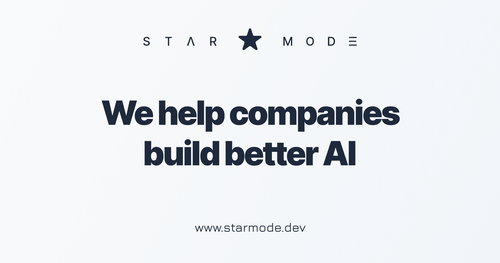

<h1 align="center">TanStack Start templates</h1>

<h3 align="center">Choose your weapon:</h3>

#### [Site template](site)

```sh
bunx gitpick starmode-base/template-tanstack-start/tree/main/site starmode-site
```

#### [App template](app)

```sh
bunx gitpick starmode-base/template-tanstack-start/tree/main/app starmode-app
```

# STΛR MODΞ TanStack Start template for apps

https://template-tanstack-start-app.vercel.app/

## Devops

1. `bunx gitpick starmode-base/template-tanstack-start/tree/main/app new-dawn-app`
1. https://vercel.com/
   1. Click _Add New..._ → _Project_
   1. Pick `new-dawn-app` from the list → _Import_
   1. Click _Deploy_
1. https://console.neon.tech/
   1. https://neon.com/docs/guides/neon-managed-vercel-integration
   1. https://vercel.com/marketplace/neon -> _Link Existing Neon Account_
   1. Click _New project_
   1. Pick a name and click _Create_
   1. Go to _Integrations_ -> _Vercel_
